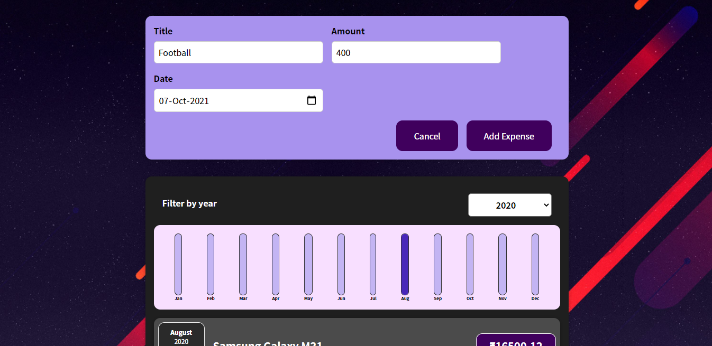

# 💰 Expense Tracker Project 💰

   

`This Project(Frontend application) is build using React JS. In this you can store all your expenses spend throughout year. And also can add new expenses along with the date. You can filter them with years.`

## Sneak-peak

## See Deployment

